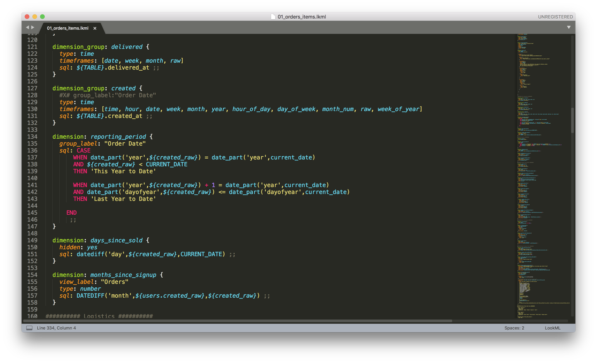

# lookml-sublime-syntax – Looker Syntax Highlighting for Sublime Text 3

This file can be added to your Sublime Text 3 configuration to display LookML files with syntax highlighting. This applies to both LookML and embedded Liquid, HTML, URLs and SQL code.

## Status and Support

The sublime-syntax format for syntax definitions is supported by Sublime Text 3 only; prior versions will not work.

This syntax definition is NOT supported or warranteed by Looker in any way. Please do not contact Looker for support. Issues can be logged via https://github.com/ContrastingSounds/lookml-sublime-syntax/issues

## Installation

1. Download the file, either by cloning the git repository (which includes a directory of test LookML files), or saving this link directly to your computer: https://raw.githubusercontent.com/ContrastingSounds/lookml-sublime-syntax/master/LookML.sublime-syntax
2. On Mac:
- Go to Sublime Text -> Preferences -> Browse Packages
- This will open up Sublime's Packages folder in a Finder window
- Drop the 'LookML.sublime-syntax' file in to the folder
3. On Windows:
- Go to Preferences -> Browse Packages
- This will open up Sublime's Packages folder in a File Explorer window
- Drop the 'LookML.sublime-syntax' file in to the folder

## Usage

Once installed, Sublime Text 3 will now display any .lkml file with full highlighting for LookML syntax:

